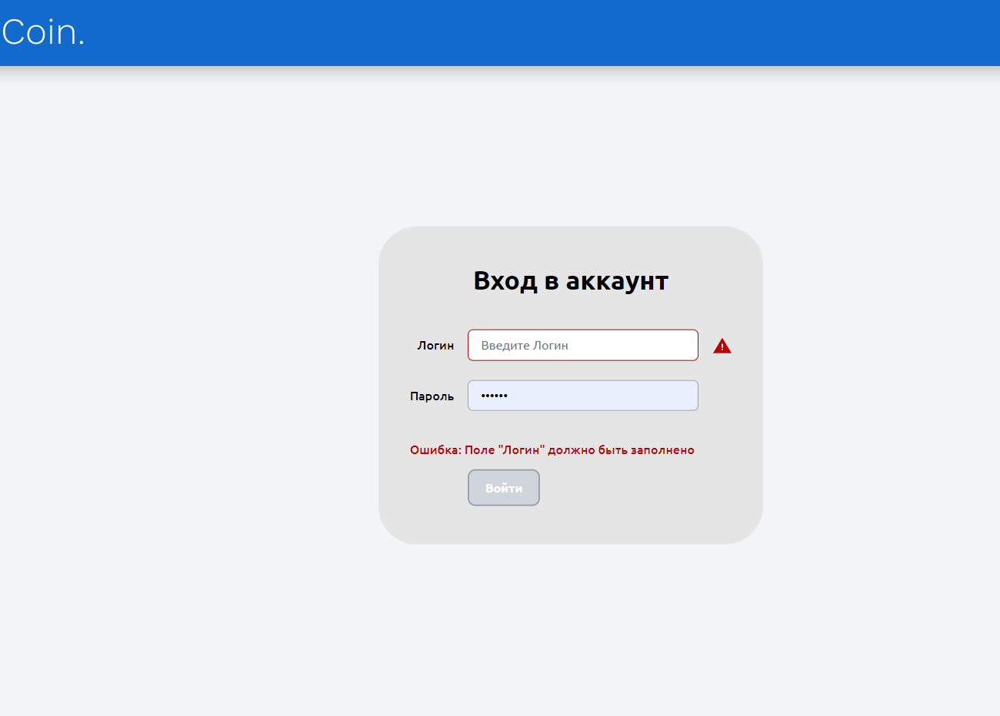
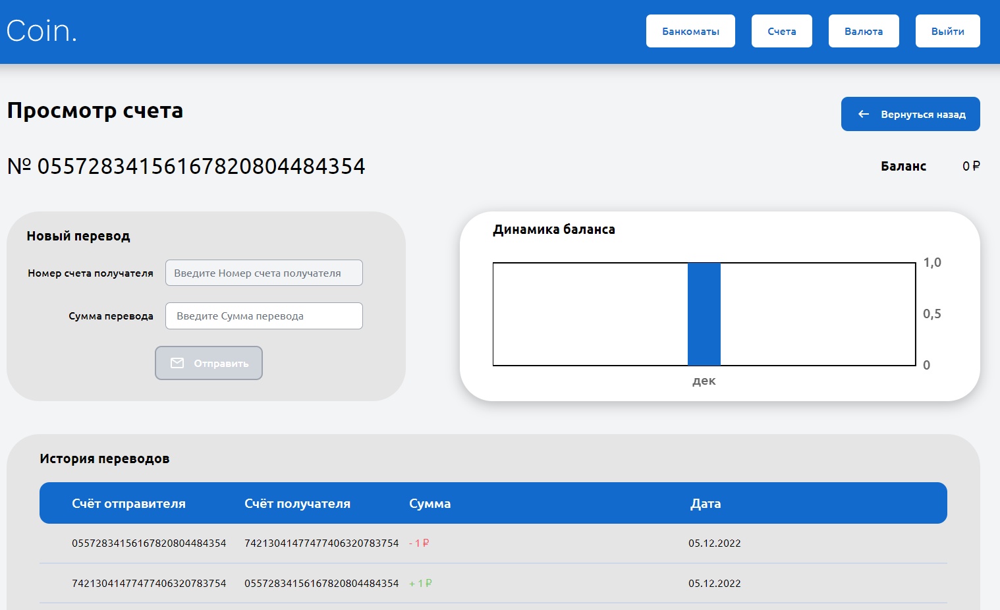
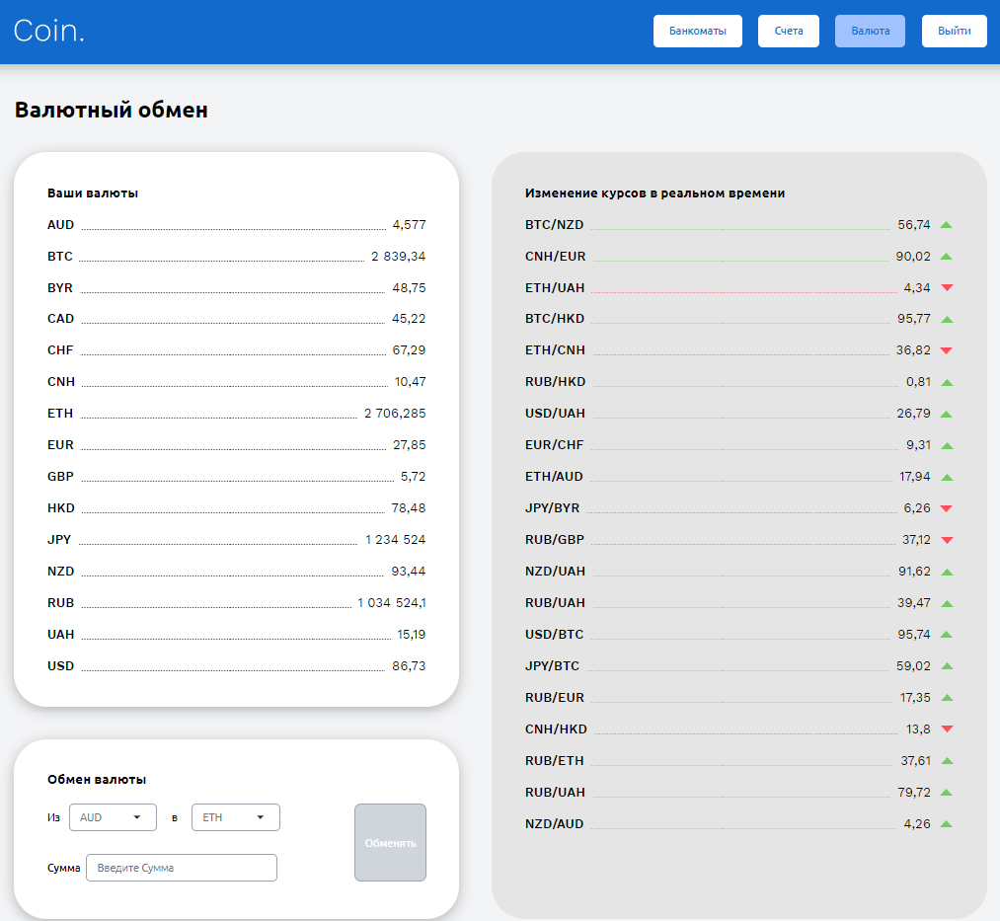

## Разработка банковской системы хранения и операций над криптовалютными средствами. 
### «CRM crypto system»

Обновление кода от 20.09.2023

**Миссия:** 
* Разработка банковской системы хранения и операций над криптовалютными средствами. 

 
**Функционал приложения:**

* Авторизация 
* Управление счетами пользователя: создание нового счёта, отображение списка  счетов, отображение баланса, просмотр истории транзакций 
* Переводы на счета или карты других пользователей 
* Возможность производить валютные обмены 
* Отображение банкоматов на карте 
* Форма входа пользователя 
* Список счетов пользователя 
* Просмотр информации о существующей карте 
* Форма для перевода средств 
* Подробная история баланса по карте 
* Мониторинг курса валют и валютные переводы
* Отображение криптовалют в режиме реального времени (API)
 

## Технические требования:

* Репозиторий должен включать в себя необходимые ресурсы для приложения и файл README с инструкциями по запуску сборки приложения. 
* Результатом сборки будет папка dist (должна создаваться или очищаться автоматически в начале процесса выполнения сборки), в которой находится страница index.html в качестве точки входа в приложения, а также все ресурсы, необходимые приложению для работы. 
* Бэкенд на данный момент разработан, но сыроват и иногда может возвращать какие-то неполные данные или данные заглушки. 
* Структуру данных и их формат (контракт API) бэкенд соблюдает корректно. Поэтому необходимо обрабатывать какие-либо неполные данные, чтобы не происходило сбоев в работы программы, уместно выводить ошибку каким-либо образом в случае получения неполных данных. 
* Ошибки в работе бэкенда влияют на работоспособность приложения в целом, только на отображение отдельных конкретных частей. 
* При долгой загрузке каких-либо данных нужно отображать какую-либо визуальную индикацию загрузки данных. Например spinner, loader или skeleton.

